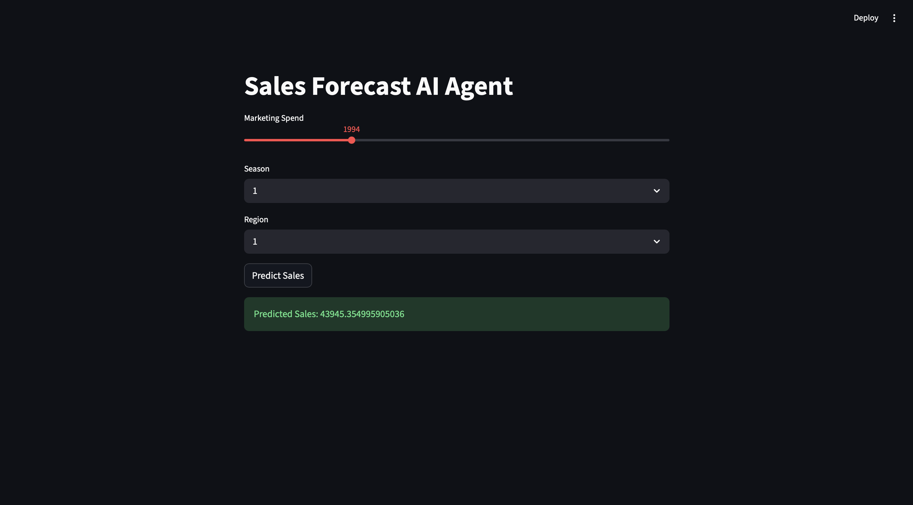

# MLflow + Streamlit Demo

This project demonstrates how to track machine learning experiments using MLflow and build an interactive UI using Streamlit.

## Preview

## What this project does

- Predicts sales based on inputs like marketing spend, season, and region  
- Tracks experiments using MLflow  
- Provides an interactive UI using Streamlit  

## Tech Stack

- Python  
- MLflow  
- Streamlit  

## Setup

git clone https://github.com/theartydev/mlflow-streamlit.git  
cd mlflow-streamlit  

python3 -m venv mlflow-env  
source mlflow-env/bin/activate  

pip install -r requirements.txt  

mlflow ui  

Open http://127.0.0.1:5000  

streamlit run app.py  

## Notes

Built to understand MLflow + Streamlit integration.
